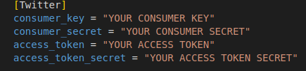
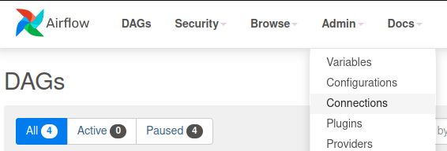
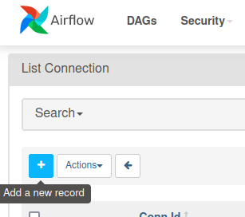
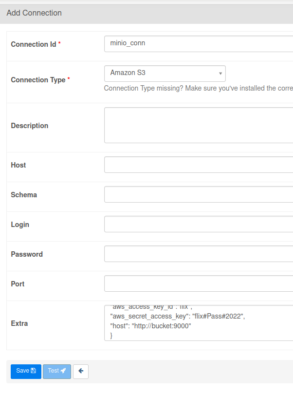
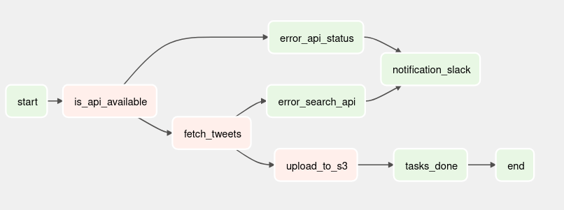

# Flix - Challenge

## Table of contents
- [Flix - Challenge](#flix---challenge)
  - [Table of contents](#table-of-contents)
  - [Project Requirements](#project-requirements)
  - [Project Structure](#project-structure)
  - [High Level Architecture](#high-level-architecture)
  - [:ship: Containers](#ship-containers)
  - [Step-by-Step](#step-by-step)
    - [1. Clone the Repository](#1-clone-the-repository)
    - [1.1 Add Twitter API credentials](#11-add-twitter-api-credentials)
    - [2. Setup environment](#2-setup-environment)
    - [3. Airflow: Create user for UI](#3-airflow-create-user-for-ui)
    - [3.1 Airflow: MinIO connection configuration](#31-airflow-minio-connection-configuration)
      - [MinIO](#minio)
  - [Pipeline](#pipeline)
  - [Stack](#stack)
  - [References](#references)

## Project Requirements

This project was develop and tested using the following environment.


|   Item             |        Version        |
|----------------|-------------------------------|
|Ubuntu          |`22.04.1 LTS`|
|Docker|`20.10.17, build 100c701`            |
|Docker Compose          |`1.29.2, build 5becea4c`            |
|Visual Studio Code          |`1.71.0`|
|Python          |`3.10.4`|
|OpenJDK          |`11.0.16`|
|Git          |`2.34.1`|

> If due to license issues you are not allowed to use Docker it's possible to replace it with [Podman](https://podman.io/) which is an alternative highly recommended for companies such as RedHat.

## Project Structure
 

This challenge is currently structured with the following specifications.

|   Path             |        Description        |
|----------------|-------------------------------|
|airflow|`Contains Airflow Dags (Pipelines)`            |
|docs          |`Project docs and pipelines (step-by-step)`            |
|imgs          |`Auxiliar folder to hold images used on this repo`|

  

## High Level Architecture

  

  


## :ship: Containers

  

*  **airflow-webserver**: Airflow v2.2.4 (Webserver & Scheduler)

   - image: andrejunior/airflow-spark:latest | Based on python:3.8-buster

   - port: 8085


*  **MinIO**: Object storage

   - image: bitnami/minio:latest


  

## Step-by-Step

  

### 1. Clone the Repository

 
`git clone https://github.com/ajnevesjr/flix-challenge`


### 1.1 Add Twitter API credentials

To setup properly our environment do not forget to add your API credentials to the config file.
You can find this file on path [./airflow/dags/credentials.ini](./airflow/dags/credentials.ini)

    

### 2. Setup environment

  
```
cd flix-challenge
docker-compose -f docker-compose.yml up -d
```
 

### 3. Airflow: Create user for UI

> **NOTE**: Before **ADD** the connections below please confirm that Airflow is up and running, it can be checked by accessing the URL [http://localhost:8085](http://localhost:8085). Have in mind that in the first execution it may take 1 to 2 minutes :stuck_out_tongue_winking_eye:


### 3.1 Airflow: MinIO connection configuration

  

1. Open the service in your browser at http://localhost:8085

2. Click on Admin -> Connections in the top bar.
    

3. Click on + sign and fill in the necessary details for each source below:
    
  

#### MinIO
  

    Conn ID: minio_conn    
    Conn Type: Amazon S3    
    Extra: consists of the JSON below:

```
{ 
"aws_access_key_id":"flix",
"aws_secret_access_key": "flix#Pass#2022",
"host": "http://bucket:9000"
}
```

Click on save:


  

## Pipeline

Please check out the documentation available on folder docs under the file [Flixbus_challenge.pdf](./docs/Flixbus_challenge.pdf)

  



 


## Stack

|        Application        |URL                          |Credentials                         |
|----------------|-------------------------------|-----------------------------|
|Airflow| [http://localhost:8085](http://localhost:8085) | |         |
|MinIO| [http://localhost:9001](http://localhost:9001) | ``` User: flix``` <br> ``` Pass: flix#Pass#2022``` |           |


## References

[airflow.apache.org](https://airflow.apache.org/docs/apache-airflow/stable/)

[puckel/docker-airflow](https://github.com/puckel/docker-airflow)

[cordon-thiago/airflow-spark](https://github.com/cordon-thiago/airflow-spark/)

[pyjaime/docker-airflow-spark](https://github.com/pyjaime/docker-airflow-spark/)

[developer.twitter.com](https://developer.twitter.com/en/docs/tutorials/)